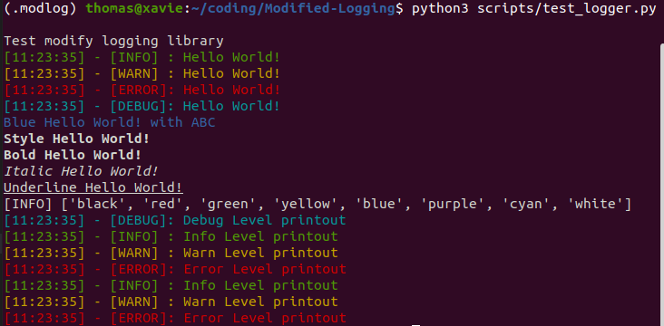
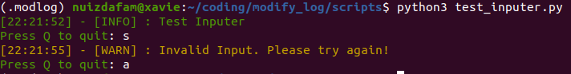

## Modified Logging | mlog

### Features
- Print out message with designated color.
- Print out messeage with specific purpose as INFO, DEBUG, ERROR, BUG for easy project management
- Print out messeage with specific styling format as BOLD, ITALIC, UNDERLINE
- Support printing out message with time.

### Installation
- Assume you're at ```project``` folder, open terminal
    ```
    git@github.com:NU-iz-da-fam/Modified-Logging.git
    ```
- (OPTIONAL) Create a virtual environment named *.modlog* or your project name
    ```
    python3 -m venv .modlog
    ```
- Navigate to *mlog* folder:
    ```
    cd ModifyLog/
    pip install -e .
    ```
- Check if mlog is installed properly, ```[22:28:04] - [INFO] : 0.1.1```
    ```
    python3 -c "import mlog; mlog.expInfo(mlog.__version__)"
    ```
### Usage
- Run test logger:
    ```
    cd scripts/
    python3 test_logger.py
    ```

    
- Run test inputer:
    ```
    cd scripts/
    python3 test_inputer.py
    ```

    

### Current Supported Methods

Main | Category 	| Method | Description 
|--- |---	|---	|---
|**Logger**|**Level**| <br/> | <br/> 
|<br/><br/>|<br/><br/>| **expInfo** | Print out text with INFO signal, green color
|<br/><br/>|<br/><br/>| **expWarn** | Print out text with WARN signal, yellow color
|<br/><br/>|<br/><br/>| **expError** | Print out text with ERROR signal, red color
|<br/><br/>|<br/><br/>| **expDebug** | Print out text with DEBUG signal, cyan color
|<br/><br/>|<br/><br/>| **expColor** | Print out text with designated color, default is white
|<br/><br/>|**Style**| <br/> | <br/> 
|<br/><br/>|<br/><br/>| **expBold** | Print out text with BOLD format
|<br/><br/>|<br/><br/>| **expUnderline** | Print out text with UNDERLINE format
|<br/><br/>|<br/><br/>| **expItalic** | Print out text with ITALIC format
|<br/><br/>|<br/><br/>| **expStyle** | Print out list of supported colors
|**Inputer**|<br/><br/>| <br/> | <br/> 
|<br/><br/>|<br/><br/>| **inputCondition** | Input from console with specific condition 

Now you can import everywhere in your project!
### About me:
- Email: nguyenbku97@gmail.com 
- Leave me a star :dizzy: if it helps 
