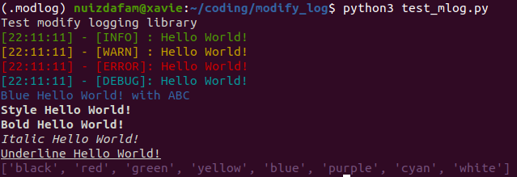

## Modified Logging | mlog

### Features
- Print out message with designated color.
- Print out messeage with specific purpose as INFO, DEBUG, ERROR, BUG for easy project management
- Print out messeage with specific styling format as BOLD, ITALIC, UNDERLINE
- Support printing out message with time.

### Installation
- Assume you're at ```project``` folder, open terminal
    ```
    git clone ...
    ```
- (OPTIONAL) Create a virtual environment named *.modlog* or your project name
    ```
    python3 -m venv .modlog
    ```
- Navigate to *mlog* folder:
    ```
    cd mlog/
    pip install -e .
    ```
- Run test file:
    ```
    python3 test_mlog.py
    ```
- Result should be like image below:  

    

### Current Supported Methods

| Category 	| Method | Description 
|---	|---	|---
|**Level**| <br/> | <br/> 
|<br/><br/>| **expInfo** | Print out text with INFO signal, green color
|<br/><br/>| **expWarn** | Print out text with WARN signal, yellow color
|<br/><br/>| **expError** | Print out text with ERROR signal, red color
|<br/><br/>| **expDebug** | Print out text with DEBUG signal, cyan color
|<br/><br/>| **expColor** | Print out text with designated color, default is white
|**Style**| <br/> | <br/> 
|<br/><br/>| **expBold** | Print out text with BOLD format
|<br/><br/>| **expUnderline** | Print out text with UNDERLINE format
|<br/><br/>| **expItalic** | Print out text with ITALIC format
|<br/><br/>| **expStyle** | Print out list of supported colors

### About me:
- Email: nguyenbku97@gmail.com 
- Leave me a star :dizzy: if it helps 